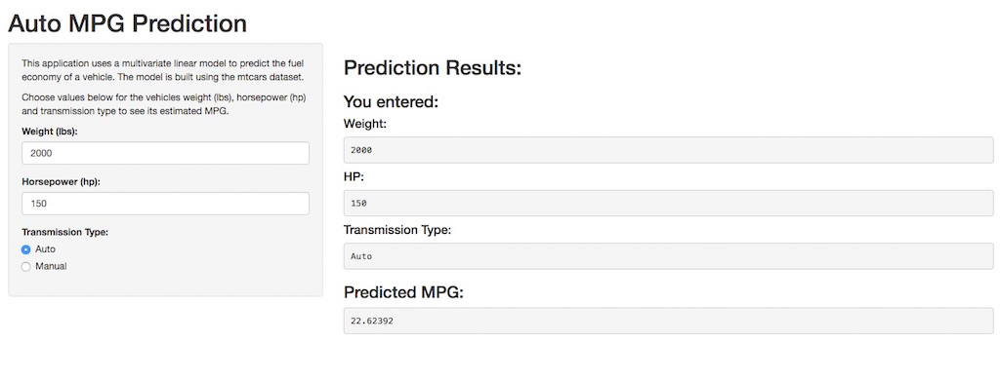

## Background

A Shiny app was built to make it easy to interactively predict the fuel economy in MPG for a vehicle 
based on several variables.

The mtcars dataset (from 1974 Motor Trend US magazine) was used to build a multivariate linear model.

---

## Model Building

A fairly efficient linear model was built using transmission type (automatic or manual), weight and horsepower. 

```{r, echo=FALSE}
library(datasets)
data(mtcars)
```

```{r}
mtcars$am <- factor(mtcars$am, labels=c('Auto', 'Manual'))
fit <- lm(mpg ~ am + wt + hp, mtcars)
summary(fit)$coef
```

---

## Usage

To use the Shiny app:

<ul>
    <li>Go to the URL http://mess0615.shinyapps.io/data-products/</li>
    <li>Enter the vehicle's weight in lbs</li>
    <li>Enter the vehicle's horsepower (hp)</li>
    <li>Choose the transmission type (auto or manual)</li>
    <li>The predicted fuel economy (in MPG) will be displayed dynamically</li>
    <li>You can change any variable interactively to see how it affects the prediction</li>
</ul>

---

## Screenshot of App


